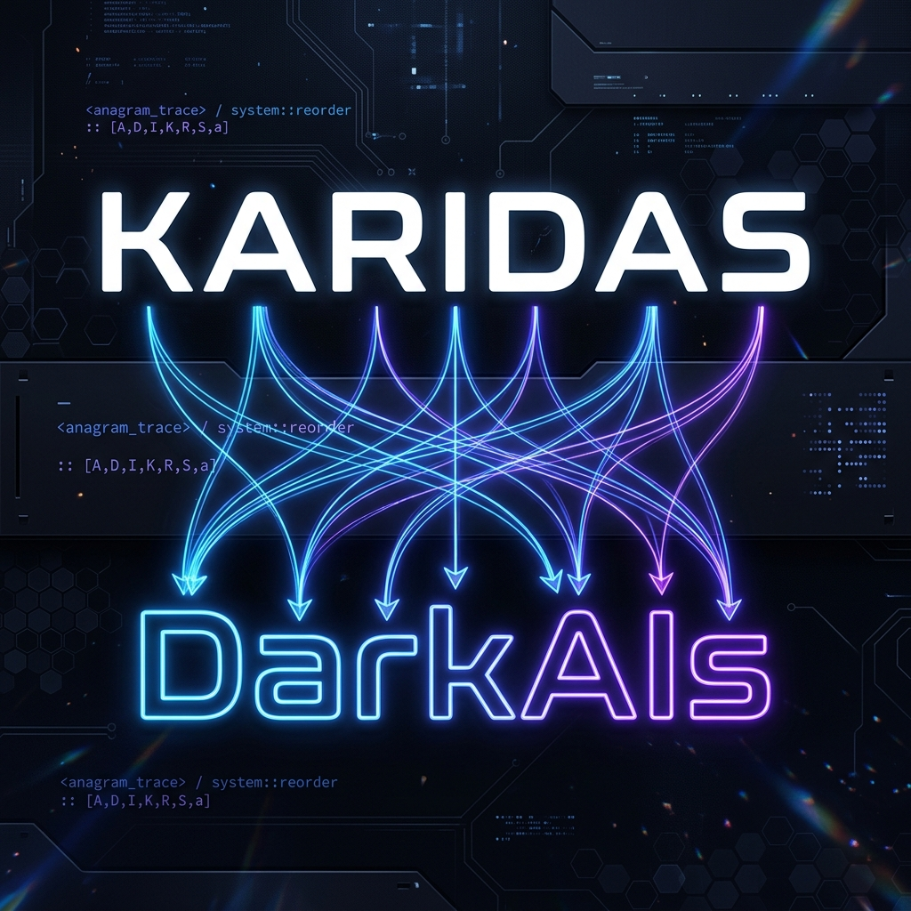

# Hello, World! I'm Dimitris Karydas 🤖

  

  

---

### 🏷️ About Me
* **Name:** Dimitris Karydas
* **Role:** 👨‍🏫 AI Educator & LLM Researcher
* **Focus:** 🧠 Neural Networks, Deep Learning, AI Instruction
* **Playing with:** 📊 Machine Learning Models & Data Science
* **Open to:** 🤝 Research collaborations & teaching opportunities

---

### 🐍 My Contributions in Snake Style

  

---

### 🛠️ Tech Stack & Tools

  
  
  
  
  
  

---

### 🚀 Featured AI Projects

| Project | Description | Tech Stack | Live Demo / Code |
|:---|:---|:---|:---|
| **[kimi-k3-intelligence](https://github.com/karidasd/kimi-k3-intelligence)** | AI model comparator: Kimi K3 vs GPT-4o, Claude, Gemini. Cost calculator, benchmark radar & multi-vendor advisor. | `Chart.js` `Vanilla JS` `AI` | [🟢 Live Demo](https://karidasd.github.io/kimi-k3-intelligence) |
| **[find-the-insiders](https://github.com/karidasd/find-the-insiders)** | On-chain Solana wallet tracker mapping transaction clusters and funding parentage. | `Solana RPC` `FastAPI` `Vis.js` | [🟢 Live Demo](https://find-the-insiders.onrender.com) |
| **[prompt-to-loop-engineering](https://github.com/karidasd/prompt-to-loop-engineering)** | 7 levels of AI progression from simple zero-shot prompting to self-correcting agentic loops. | `AI Agents` `Python` `ReAct` | [💻 Code](https://github.com/karidasd/prompt-to-loop-engineering) |
| **[over-under-predictions](https://github.com/karidasd/over-under-predictions)** | Automated betting engine predicting Over/Under 2.5 football matches daily via GitHub Actions. | `Python` `Poisson` `CI/CD` | [🟢 Live Dashboard](https://karidasd.github.io/over-under-predictions/) |
| **[remote-work-tools-2026](https://github.com/karidasd/remote-work-tools-2026)** | Hard-nosed, opinionated analysis of how 19 remote work tools have been transformed by AI. | `AI Stack` `Data Science` | [🟢 Live Dashboard](https://karidasd.github.io/remote-work-tools-2026/) |
| **[technical-debt-analyzer](https://github.com/karidasd/technical-debt-analyzer)** | AST-based static analyzer CLI measuring cognitive load and code duplication. | `Python` `AST` `Metrics` | [💻 Code](https://github.com/karidasd/technical-debt-analyzer) |

---

### 📊 GitHub Activity

  

  

---

### 📫 Let's Connect

  
  
  

---

  <i>"Demystifying AI, one project at a time."</i>

